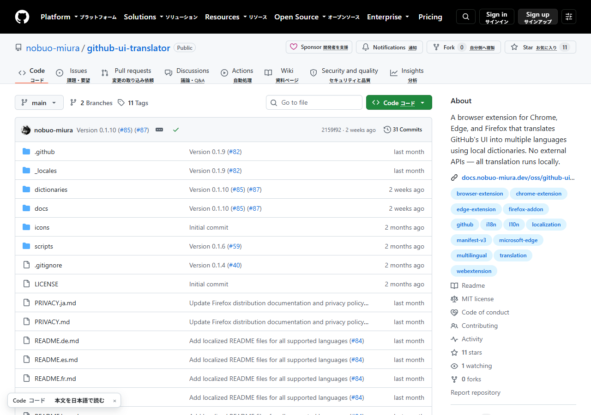
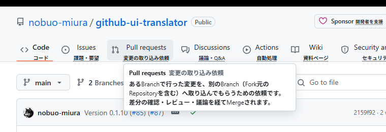

# GitHub 日本語アシスト（開発版）

[English](README.md) | [日本語](README.ja.md)

GitHub の英語の画面を、**英語の用語はそのまま残して**、小さな日本語と用語の説明で読みやすくする Chrome 拡張機能です。
「Pull requests」「Fork」「Commit」のような GitHub・Git の用語を英語のまま覚えながら、それが何を意味するのかを日本語で確かめられます。



## できること

| | |
|---|---|
| **小さな日本語** | 英語ラベルの横（タブは下）に、意味の分かる短い日本語を添えます。例: `Pull requests` → 変更の取り込み依頼、`Fork` → 自分側へ複製 |
| **用語の説明** | 点線の付いた日本語にマウスを乗せる（または Tab キーで移動する）と、その機能が何なのかを説明します |
| **ページガイド** | 画面左下に「今いるページが何をする場所か」を小さく表示します。クリックすると説明が開きます |
| **本文の翻訳（任意）** | README・Issue・Pull request の本文を、ボタンを押したときだけ端末内で日本語に訳し、原文の下に表示します |
| **足りない日本語の報告** | 設定画面の「このページで日本語が付いていない文言をコピー」で、今見ているページの英語のままの文言をまとめてコピーできます。開発者に送ると辞書に追加できます |

**変えないもの**: コード、差分（diff）、ファイル名・フォルダ名、リポジトリ名、ユーザー名、ブランチ名、タグ、コミットID、URL、README などの本文（頼まれない限り）。GitHub の検索・メニュー・ダイアログ・キーボードショートカットもそのまま使えます。



## 1. Chrome への導入方法

開発版なので Chrome ウェブストアには公開していません。次の手順で読み込みます。

1. 配布された `github-ja-assist-v0.3.0.zip` を展開します（または下の「開発者向け」の手順で `dist/github-ja-assist` を作ります）。
2. Chrome のアドレスバーに `chrome://extensions` と入力して開きます。
3. 右上の **デベロッパーモード** を ON にします。
4. **パッケージ化されていない拡張機能を読み込む** を押し、展開したフォルダ（`manifest.json` が入っているフォルダ）を選びます。
5. ツールバーのパズルのアイコンから「GitHub 日本語アシスト」を **ピン留め** しておくと、設定をすぐ開けます。
6. GitHub のページを開く（開いていたページは再読み込みする）と、日本語が表示されます。

新しい版に入れ替えるときは、フォルダを置き換えてから `chrome://extensions` でこの拡張機能の更新ボタン（↻）を押し、GitHub のタブを再読み込みしてください。手動で読み込んだ拡張機能は自動では更新されません。

## 2. ON/OFF

ツールバーのアイコンを押すと設定が開きます。いちばん上の **日本語アシスト** のスイッチで、拡張機能全体の ON/OFF を切り替えます。切り替えると、開いている GitHub のタブが自動で再読み込みされます。

## 3. 表示モード

| モード | 見え方 | こんな人に |
|---|---|---|
| **英語＋小さな日本語（おすすめ・既定）** | `Pull requests` の下に「変更の取り込み依頼」 | 英語の用語を覚えながら使いたい |
| **日本語を主に、英語を小さく** | 「変更の取り込み依頼」の下に `Pull requests` | まず日本語で意味をつかみたい |
| **英語のみ（GitHub 標準）** | GitHub そのまま（ページガイドと本文翻訳ボタンは使えます） | 補助なしで使いたい |

- 「英語＋小さな日本語」では、GitHub の文字や読み上げ用の情報（`aria-label` など）を書き換えません。スクリーンリーダーは元の英語のまま読み上げます。例外は入力欄の薄い案内文で、英語の後ろに日本語を足すため、案内文がそのまま欄の名前になっている入力欄では、読み上げにも英語に続いて日本語が入ります。
- 「日本語を主に」は元にした拡張機能（GitHub UI Translator）と同じ置き換え方式で、読み上げ用の情報も日本語になります。
- 「英語＋小さな日本語」では、ボタン・タブ・メニューに加えて、すべてのページの見出し・リンク・表の見出し・GitHub 自身の説明（ツールチップ）・入力欄の薄い案内文（例: `Find a repository… （リポジトリを検索）`）にも日本語を付けます。文字を書き換えないので、誤ってユーザーの文字に当たっても横に訳が付くだけです。「日本語を主に」は文字を置き換えるため、元にした拡張機能が画面ごとに確かめた範囲だけにしています。
- リポジトリ一覧や検索結果のように、リンクの表示がそのリンク先のユーザー名・リポジトリ名になっているもの、トピック、検索結果の一致部分は、ユーザーの文字として扱い日本語を付けません。
- 短い日本語（16 文字まで）は英語の横に、長い日本語は英語の下の行に出します（ボタンの中ではボタンの高さを崩さないよう、マウスを乗せたときの説明にだけ出します）。「日本語を主に」で添える英語は 40 文字まで、それより長い英語は説明にだけ出ます。ページ上部のヘッダーで下に重ねられない項目も、説明にだけ出ます。
- 次の 3 つは個別に ON/OFF でき、切り替えはすぐ反映されます（再読み込みなし）: **用語の説明**、**ページガイド**、**本文翻訳ボタン**。
- ページガイドは × で閉じると、そのタブでは表示されなくなります。完全に消したいときは設定で OFF にしてください。

## 4. 本文の翻訳

README・Issue・Pull request の画面では、ページガイドの横に **本文を日本語で読む** ボタンが出ます。

- 押したときだけ翻訳します。自動では翻訳しません。
- 翻訳には Chrome に内蔵された翻訳機能（Translator API）を使い、**この端末の中で**処理します。本文を外部のサーバーへ送ることはありません。
- 初めて使うときは、Chrome が翻訳用のデータ（言語パック）をダウンロードするので少し時間がかかります。進み具合はボタンの下に表示されます。
- 訳は原文の各段落の下に、左に線の付いた薄い文字で表示します。原文はそのまま残ります。
- コードブロックは翻訳しません。文中のコード（`npm install` など）は訳の中でもコードのまま残るようにしています。
- もう一度押す（「訳を消す」）と訳が消えます。翻訳中に押すと中止します。
- 翻訳機能が使えないブラウザでは、ボタンが **本文翻訳: 非対応** と表示され、押すと理由が表示されます。
- ボタンの表示を決めるため、ページを開いたときに「このブラウザで英語→日本語の翻訳が使えるか」だけをブラウザに問い合わせます（本文は渡さず、何も送信しません）。翻訳器の作成と翻訳は、ボタンを押したときだけです。

## 5. 日本語が付いていない所を見つけたら

GitHub は画面をよく変えるので、辞書に無い文言が出てきます。そのときは:

1. 英語のままの文言があるページを開いたまま、ツールバーの拡張機能のアイコンを押します。
2. 設定画面の下にある **このページで日本語が付いていない文言をコピー** を押します。
3. コピーされた一覧（1 行に 1 つの文言と、その場所）を開発者へのメッセージに貼り付けて送ってください。

- 集めるのは、ボタン・リンク・見出しなど画面の固定の文言と、ページの種類です。ページの種類は実際のアドレスではなく、GitHub 自身が名前を伏せて記録している形（例: `/<user-name>/<repo-name>/issues`）にします。
- コード・README・Issue の本文・リポジトリ名・ユーザー名は、日本語化と同じ除外ルールで外します。ただし完全ではないので、送る前に中身を確認してください。
- 集めた一覧はクリップボードにコピーするだけで、拡張機能がどこかへ送ることはありません。

## 6. プライバシー

- 集めるデータ・送るデータはありません。GitHub のパスワードやトークンにも触れません。
- 画面の日本語と説明は、拡張機能に同梱した辞書だけで表示しています。
- 本文翻訳は端末内で行います（Chrome が翻訳モデルを最初に取得することはあります）。
- 必要な権限は `storage`（設定の保存）だけで、動くのは `https://github.com/` の上だけです。

詳しくは [PRIVACY.ja.md](PRIVACY.ja.md) を見てください。

## 7. 対応ブラウザ

| ブラウザ | 画面の日本語・説明・ページガイド | 本文の翻訳 | 確認状況 |
|---|---|---|---|
| Chrome 138 以降（デスクトップ） | ○ | ○（Translator API） | 画面部分は自動テストで確認（Chrome for Testing 153）。**本文の実翻訳は未確認**（下の「既知の制限」） |
| Chrome 137 以前 | ○ | 非対応と表示 | 未確認 |
| Microsoft Edge | ○ | この PC の Edge 148 では英語→日本語が使えず「非対応」と表示 | Edge 148 で自動テスト |
| Firefox | 設定ファイル上は元の拡張機能を引き継いでいるが | 非対応と表示されるはず | **未確認** |

## 8. 既知の制限

- **辞書にある固定の文言だけ**が対象です。「3 commits」「Commits on Aug 1, 2026」のように数字や日付を含む文言、「2 weeks ago」のような相対時刻、ユーザーが作った文字は対象外です。足りない文言は「5.」の手順で知らせてください。
- 説明文の段落（`<p>`。例: ダッシュボードのお知らせ枠の説明）は、ユーザーの文章が混ざりやすいため日本語化しません。
- 入力欄の案内文は、欄の幅が狭いと日本語の後ろが切れて見えます（例: `Go to file （ファイルを探`）。
- GitHub が画面の作りを変えると、日本語が付かなくなったり、まれにユーザーが作った文字に付いたりすることがあります（元にした拡張機能と同じ仕組み上の制約）。
- 自動テストは **ログインしていない状態の公開ページ** で行っています。ログイン後だけに出る画面（リポジトリの Settings など）は、GitHub を模したテスト用ページでのみ確認しています。
- **本文の実際の翻訳は、この開発環境では確認できていません。** テストに使う Chrome for Testing には翻訳モデルが配信されず、Edge 148 では英語→日本語が「利用不可」でした。翻訳結果を差し込む処理は模擬の翻訳器で、中止と非対応の表示は実ブラウザで確かめています。通常の Chrome 138 以降での確認は人の手で行う必要があります。
- 本文翻訳は英語→日本語だけです。英語以外の本文は訳しません（日本語・中国語・韓国語が主の段落は飛ばします）。訳の中ではリンクは押せません（原文のリンクを使ってください）。
- 用語の説明ツールチップは見た目の補助で、スクリーンリーダーには読み上げられません（マウスを説明の上に移しても消えず、Esc で閉じられます）。
- ページガイドを × で閉じると、キーボードのフォーカスはページ全体に戻ります。
- 説明（ツールチップ）の上にマウスがあるときの最初のクリックは、説明を閉じるだけです。
- 「日本語を主に」ではタブの文字が英語より長くなるため、画面が狭いとき（200% ズームなど）はリポジトリのタブが1つ多く GitHub の「…」メニューに入ることがあります。「英語＋小さな日本語」ではタブの数は変わりません。
- 狭い画面では、左下のページガイドが画面下端の内容に重なることがあります。× で閉じるか、設定で OFF にしてください。
- `github.com` 以外（GitHub Enterprise など）では動きません。

## 開発者向け

```bash
npm install                 # Playwright（テスト用。拡張機能の実行には不要）
npx playwright install chromium
npm run validate            # 辞書・グロッサリー・ロケールの検証
npm test                    # 模擬ページでの自動テスト（外部通信は遮断して確認）
npm run test:live           # 実際の github.com（公開ページ・未ログイン・読み取りのみ）でのテスト
npm run build               # dist/github-ja-assist と zip を作成
```

配布用ビルドそのものをテストするには、`GHJA_EXTENSION_DIR=dist/github-ja-assist npm test`（PowerShell では `$env:GHJA_EXTENSION_DIR='dist/github-ja-assist'; npm test`）。

- 設計の判断と調査結果: [DESIGN.md](DESIGN.md)
- 用語と説明の辞書: `dictionaries/glossary.ja.json`（画面の英語と完全一致で照合。`ja` が添える日本語、`description` が説明、`aliases` が別表記）
- 画面文言の辞書（元の拡張機能のもの）: `dictionaries/ja.json`、翻訳対象の範囲: [docs/translation-scope.ja.md](docs/translation-scope.ja.md)

## ライセンスと元にした拡張機能

[MIT License](LICENSE)。本拡張機能は [nobuo-miura/github-ui-translator](https://github.com/nobuo-miura/github-ui-translator)（MIT License, Copyright (c) 2026 Nobuo Miura）の 0.1.10 を元に、学習モード・用語の説明・ページガイド・本文翻訳を追加したものです。翻訳エンジンと画面文言の辞書（`dictionaries/*.json`）は元の拡張機能のものを使っています。
