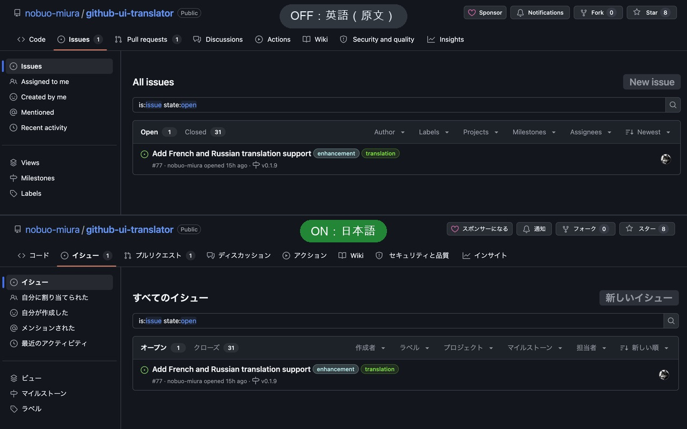
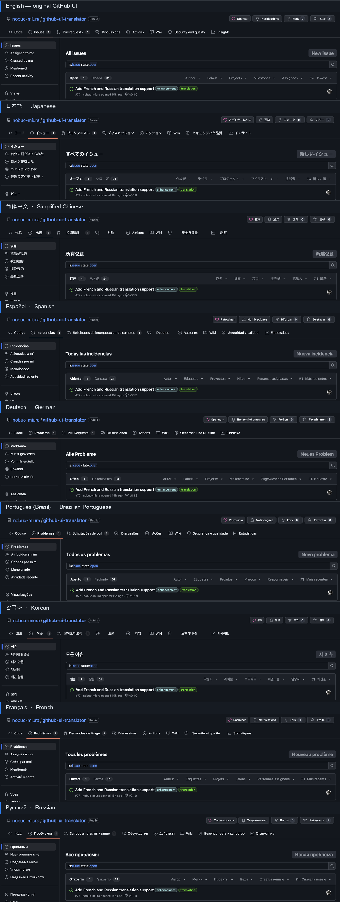

# GitHub UI Translator

[English](README.md) | [日本語](README.ja.md) | [简体中文](README.zh-CN.md) | [Español](README.es.md) | [Deutsch](README.de.md) | [Português (Brasil)](README.pt-BR.md) | [한국어](README.ko.md) | [Français](README.fr.md) | [Русский](README.ru.md)

[](https://github.com/nobuo-miura/github-ui-translator/releases/latest)
[](https://chromewebstore.google.com/detail/github-ui-translator/igdplojdbbpfbedgoaokfcagpkofmngk)
[](https://microsoftedge.microsoft.com/addons/detail/fgjocjmjjghflobobinafkbkeildanoj)
[](https://addons.mozilla.org/firefox/addon/github-ui-translator/)
[](https://github.com/nobuo-miura/github-ui-translator/actions/workflows/validate.yml)
[](./LICENSE)

GitHub UI Translator 是一款适用于 Chrome、Edge 和 Firefox 的浏览器扩展。它使用本地词典，将 GitHub 的英文界面翻译成日语、简体中文、西班牙语、德语、巴西葡萄牙语、韩语、法语或俄语。
本扩展不依赖外部翻译 API 或云服务；所有翻译均在浏览器本地完成。



<details>
<summary>全部 8 种支持语言的截图</summary>

第一行是 GitHub 原始的英文界面，下面每一行分别展示一种语言的翻译效果。



</details>

## 功能特点

- 所有翻译均在本地完成，不会将页面内容或设置发送到外部服务
- 仅翻译导航项、按钮等 GitHub 固定界面文本，并避开 README、议题、评论和代码块等用户创建的内容区域
- 可在扩展弹出窗口中一键开启或关闭翻译
- 等待 GitHub 的 React 水合完成后再翻译全局页眉，以降低影响全局搜索的风险；也可以在弹出窗口中关闭此功能

## 文档

- [翻译范围（English）](docs/translation-scope.md)（[日本語](docs/translation-scope.ja.md)）

## 限制

- 目前支持日语、简体中文、西班牙语、德语、巴西葡萄牙语、韩语、法语和俄语。随着翻译覆盖范围逐步完善，今后还会增加其他语言。
- 不翻译包含数字或日期的动态文本，例如“3 commits”或“opened 2 days ago”。用户名等用户创建的内容也不在翻译范围内。详情请参阅[翻译范围](docs/translation-scope.md)。
- 仅支持 `github.com`，不支持 GitHub Enterprise 或其他自定义域名。
- 已在 Chrome、Edge 和 Firefox 上完成测试。其他基于 Chromium 的浏览器可能也能正常使用，但尚未进行明确测试。

## 安装

### Chrome

请从 [Chrome 应用商店](https://chromewebstore.google.com/detail/github-ui-translator/igdplojdbbpfbedgoaokfcagpkofmngk)安装 GitHub UI Translator。

如果所在环境无法使用 Chrome 应用商店（例如由公司管理的设备），可以手动安装：

1. 从[最新版本](https://github.com/nobuo-miura/github-ui-translator/releases/latest)下载 `.zip` 文件并解压。
2. 在 Chrome 中打开 `chrome://extensions`，然后启用“开发者模式”。
3. 点击“加载已解压的扩展程序”，并选择解压后的文件夹。

手动安装的扩展不会自动更新。发布新版本后，请重复上述步骤进行更新。组织策略也可能禁止开发者模式或手动安装扩展；遇到这种情况时，请联系管理员。

### Edge

请从 [Microsoft Edge 加载项](https://microsoftedge.microsoft.com/addons/detail/fgjocjmjjghflobobinafkbkeildanoj)安装 GitHub UI Translator。

### Firefox

需要 Firefox 142 或更高版本。

请从 [Firefox 附加组件](https://addons.mozilla.org/firefox/addon/github-ui-translator/)安装 GitHub UI Translator。

安装后，打开 `https://github.com/...` 等 GitHub 页面，支持的界面文本便会自动翻译成当前选择的语言。

### 开发安装（直接从仓库加载）

如果要自定义词典或参与开发，请克隆仓库并直接加载扩展。

```sh
git clone https://github.com/nobuo-miura/github-ui-translator.git
```

- **Chrome / Edge**：在 Chrome 中打开 `chrome://extensions`，或在 Edge 中打开 `edge://extensions`，启用开发者模式，点击“加载已解压的扩展程序”，然后选择包含 `manifest.json` 的克隆目录。
- **Firefox**：打开 `about:debugging#/runtime/this-firefox`，点击“临时载入附加组件…”，然后选择仓库中的 `manifest.json`。临时附加组件会在 Firefox 重启后被移除，因此每次会话都需要重新加载。

## 使用方法

- 点击工具栏中的扩展图标，可以打开翻译开关和语言选择器。目前内置日语、简体中文、西班牙语、德语、巴西葡萄牙语、韩语、法语和俄语；添加新词典后，下拉列表也可继续扩展。
- 更改翻译开关或语言后，已打开的 GitHub 标签页会重新加载，以应用新设置。
- 弹出窗口还可设置是否翻译全局页眉，并提供本仓库的链接。修改此选项也会重新加载已打开的 GitHub 标签页。全局页眉翻译默认开启，并会等待 GitHub 的 React 水合完成；如果全局搜索无法打开，可关闭此选项。
- 在扩展选项页面中，可以查看内置词典信息和扩展版本。Chrome 使用 `chrome://extensions`，Edge 使用 `edge://extensions`，Firefox 使用 `about:addons`。

## 自定义词典

直接编辑目标语言的词典文件即可添加或修改翻译，例如 `dictionaries/ja.json`、`dictionaries/zh-CN.json`、`dictionaries/es.json`、`dictionaries/de.json`、`dictionaries/pt-BR.json`、`dictionaries/ko.json`、`dictionaries/fr.json` 或 `dictionaries/ru.json`。
词条按 GitHub 页面分组（如仓库导航、仓库设置和组织设置），每个分组前都有一行 `// ====` 注释，方便快速确认词条所属页面，并及时发现 GitHub 界面文本的变化。

```jsonc
{
  "language": "ja",
  "name": "日本語",
  "translations": {
    // ==== 仓库导航 ====
    "Code": "コード",
    "Issues": "イシュー"
  }
}
```

- 词典文件采用带有 `//` 行注释的 JSON（类似 JSONC）。仅支持整行注释，不支持在值后添加行尾注释。标准的 `JSON.parse` 和 `fetch().json()` 无法解析注释，因此扩展会先移除注释行再解析文件。
- 词典键必须与原始英文文本**完全一致**。匹配可见文本和支持的属性值时，都会忽略首尾空白。仅对于可见文本，连续空白（包括换行）会折叠为一个空格。匹配 `aria-label`、`placeholder`、按钮 `value` 和 `data-disable-with` 等属性值时，会保留其内部空白。词典键本身不得包含首尾空白。
- 编辑词典后，请重新加载扩展：Chrome 使用 `chrome://extensions`，Edge 使用 `edge://extensions`，Firefox 使用 `about:debugging`。

### 添加新语言

1. 按照相同格式添加 `dictionaries/<code>.json`（例如 `dictionaries/en.json`）。
2. 将 `{ "code": "<code>", "name": "<display name>" }` 添加到 `languages.json`。弹出窗口和选项页面都会读取此共享列表。
3. 运行 `node scripts/validate.mjs`，检查词典格式、重复键、元数据、内置词典之间的键一致性、自映射、翻译链以及不收敛的循环。

弹出窗口、选项页面以及扩展元数据使用浏览器扩展的 `_locales` 机制，与 GitHub 翻译词典相互独立。如果还要为扩展自身的界面添加新语言，请创建 `_locales/<code>/messages.json`，并确保其消息键与 `_locales/en/messages.json` 一致。

## 项目结构

```text
github-ui-translator/
├─ manifest.json
├─ shared.js        # 共享语言列表和扩展界面本地化辅助函数
├─ languages.json   # 内置的 GitHub 翻译语言
├─ content.js       # 使用允许列表扫描 DOM 的翻译引擎
├─ popup.html/js    # 带有翻译开关的工具栏弹出窗口
├─ options.html/js  # 词典信息和版本显示
├─ _locales/        # 本地化的弹出窗口、选项页面和扩展元数据消息
├─ dictionaries/
│  ├─ ja.json       # 日语词典
│  ├─ zh-CN.json    # 简体中文词典
│  ├─ es.json       # 西班牙语词典
│  ├─ de.json       # 德语词典
│  ├─ pt-BR.json    # 巴西葡萄牙语词典
│  ├─ ko.json       # 韩语词典
│  ├─ fr.json       # 法语词典
│  └─ ru.json       # 俄语词典
├─ docs/
│  ├─ translation-scope.md     # 英文版
│  └─ translation-scope.ja.md  # 日文版
├─ scripts/
│  └─ validate.mjs  # 词典和本地化验证
└─ icons/
```

## 许可证

[MIT 许可证](./LICENSE)
